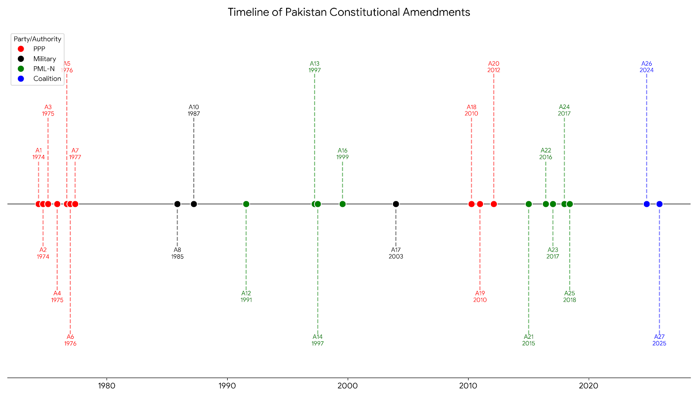
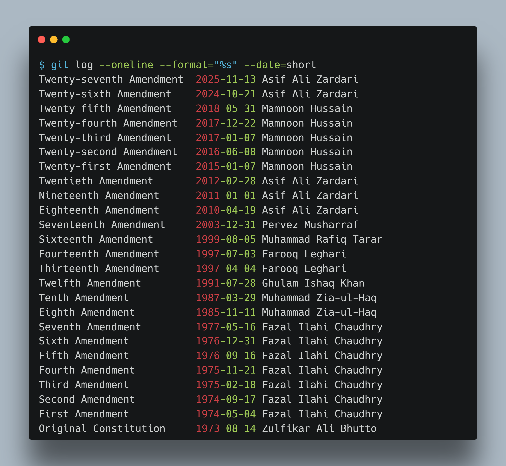

# legalize-pk

The Constitution of Pakistan - one article per file, one amendment per commit.

---

## The idea

Most people encounter the constitution as a single long document or scattered PDFs. That makes it difficult to see what changed, when, and in which part of the text.

This repository splits the 1973 Constitution into individual Markdown files - one per article - and records each enacted amendment as a backdated Git commit that updates only the articles it actually changed. The result is a history you can navigate with standard Git tools:

Each commit is backdated to the amendment's actual date of assent, so the repository's history mirrors constitutional time rather than the order files were created.

The repository covers all 24 enacted amendments from 1974 through 2025 (the 9th, 11th, and 15th were proposed but never passed). The most recent is the 27th Amendment of November 2025.

---

## Repository structure

```
legalize-pk/
├── federal-constitution/
│   ├── preamble.md
│   ├── article-001.md
│   ├── article-002.md
│   └── ...
└── federal-amendment-summaries/
    ├── 1974-01-first-amendment.md
    ├── 1974-02-second-amendment.md
    └── ...
```

**federal-constitution/** — one file per article, named with zero-padded numbers so they sort correctly. Omitted articles are kept as files with a single `[Omitted]` line so their history remains intact.

**federal-ammendment-summaries/** — one plain-English summary per enacted amendment, created in the same commit as the amendment itself. Each file includes the date of assent, the articles affected, and a link to the source text.

---



---
## Why it matters

The constitution is the foundation of rights, institutions, and the balance of power. When that text is structured and version-controlled, it stops being a static document and becomes something you can reason about - article by article, amendment by amendment, over half a century.

This work is shared openly in the hope that it proves useful: to students and researchers tracing how a particular right or institution evolved, to journalists covering constitutional change, to civic organizations that want to explain the law to a broader public.

It is also intended as a clean data source for software and AI. A language model given structured constitutional text - where each article is discrete, each amendment is a diff, and the history is intact - can answer questions like *"what did Article 63 say before the 18th Amendment?"* or *"which articles have been amended more than twice?"* with far more precision than one working from a monolithic PDF. *Structured law is more useful law.*


---

## Explore the history

Every amendment is a backdated Git commit. The repository's timeline mirrors constitutional time:



```bash
# See every amendment that touched Article 239
git log -- federal-constitution/article-239.md

# Compare the article's text before and after the 18th Amendment
git diff <commit-hash-before> <commit-hash-after> -- federal-constitution/article-239.md

# Read the full article as it stood on a given date
git show <commit-hash>:federal-constitution/article-239.md

# See all amendments by a specific president
git log --author="Fazal Ilahi Chaudhry" --oneline --date=short --format="%ad %s"

# See what files changed in a specific amendment
git show --stat <commit-hash>

# List all amendments in order with dates
git log --oneline --format="%ad %s" --date=short

```

> To find commit hashes, run `git log --oneline`. Each line starts with a short hash you can use in the commands above.
>
> To list all presidents who signed amendments: `git log --format="%an" | sort -u`


---


## Sources

- [Original 1973 Constitution (PDF)](https://factfocus.com/wp-content/uploads/2021/03/Original-Constitution-of-1973-Pakistan.pdf) — Original 1973 Constitution of Pakistan
- [Pakistani.org](https://pakistani.org/pakistan/constitution/) — Amendment index and full text links from Amendment 1-21
- [National Assembly of Pakistan](https://www.na.gov.pk/uploads/documents/671f74b8da9e0_263.pdf) — for some amendments
- [Wikipedia](https://en.wikipedia.org/wiki/Amendments_to_the_Constitution_of_Pakistan) — amendment index and dates

Amendment summaries were generated using Gemini and OpenAI.
Each article file in the federal-constitution/ also contains the links to the amendments that changed it.

---

This repository is inspired by [legalize-es](https://github.com/legalize-dev/legalize-es) which did similar work for the Spanish Constitution.

## Author

Built by [Umer Butt](https://www.linkedin.com/in/umertariq1/)

---

## License

The legislative texts are in the public domain. The structure and format are under the [MIT License](https://opensource.org/licenses/MIT).